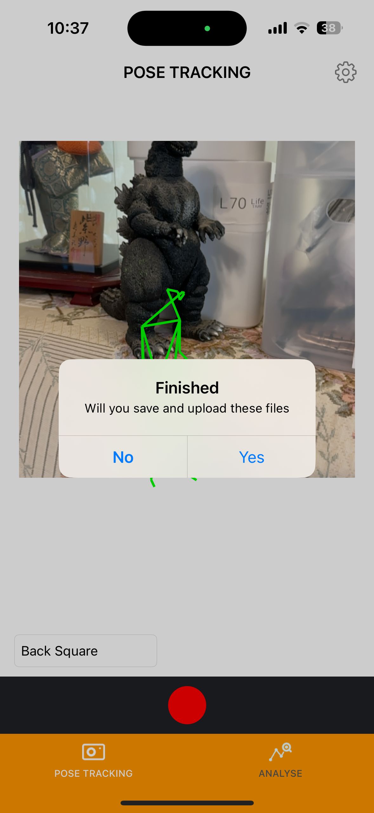

# Pose Analysis 0.20

## Overview

Sign up as a team administrator using the dedicated iOS app and purchase measurement tickets via in-app purchases. 
Both team administrators and their members can log in to the iOS app, conduct pose estimation, input basic data linked to the estimation, and upload it to the cloud. 
Team administrators can manage team members and their measurement data via a web dashboard. 

## How to Use

### User Management

The structure consists of one team administrator and multiple team members.

#### Registering a Team Administrator

On the iOS app's top screen, press the "Sign Up" button to navigate to the administrator registration screen. 
 

Fill in the required information on the registration screen and press the "Register" button to create an administrator account. 
 

#### Managing Members

User management is also available within the iOS app. 
After logging in, select the "MY PAGE" tab at the bottom right, then choose "User Management" at the top to navigate to the user list screen. 
 
 

This screen displays a list of all team members. 
Each entry is displayed in the format: "{Admin or Member}: {Full Name}: {Email Address}." 

When you tap on any member from the list, an alert is displayed. Selecting “Delete” in the alert will remove the selected member. 
 

Pressing the "+" button at the top right navigates to the "Add Member" screen. 
 

Fill in the new member's information and press the "Register" button to add the member. 

#### Logging in to the Web Dashboard and Adding Members

Team administrators can log in to the web dashboard: 
Pose Analysis Dashboard 
<a href="https://pose-analysis-dashboard.com">https://pose-analysis-dashboard.com</a> 

 

After logging in, press the "User Management" button on the top page to navigate to the user management screen. 

 
 

Press the "Add User" button to display a form at the bottom for entering new user information. 
Fill out the form and press "Submit" to add the user to the team. 
 
 

#### Logging in to the iOS App as a Member

Members can log in to the iOS app using their account credentials. 
 

### Measurement

Pose estimation results and videos measured with the iOS app can be uploaded to the cloud. 
Saving and uploading measured data to the cloud requires purchasing tickets through in-app purchases. 
Tickets, such as 500-use bundles, are available for purchase and are consumed each time a team member saves or uploads data. 
 
Team administrators can view, annotate, and download data uploaded by team members through the web dashboard. 

#### iOS App

##### Displaying Remaining Measurement Counts

Select the "MY PAGE" tab to view the remaining measurement counts under "Measurement > Current Available Times." 
 

An alert is displayed after each measurement, asking whether to save and upload the result. 
This allows control over ticket consumption, preventing unnecessary reduction of remaining counts if the measurement is unsatisfactory. 
 

##### Purchasing Measurement Tickets

Select the "MY PAGE" tab and navigate to "Measurement > Purchase Tickets" to view available tickets. 
 
 

Select the desired ticket to purchase it. 

#### Web Dashboard

Log in with the administrator account, then press the "View Managements" button on the top page to display a list of measurements. 
 
 

The screen displays a chronological list of measurement data for all team members in descending order. 
Each entry includes the following fields:

- Id (Measurement ID)
- UserId
- Full Name
- Gender (Male/Female)
- Age
- Memo (Entered during measurement in the iOS app)
- Thumbnail (Generated from the middle frame of the video)
- Admin Memo (Custom notes by the administrator)

Search filters are available for the following fields:

- Id
- Full Name
- Gender (All/Male/Female)
- Age
- Memo
- Admin Memo

##### Downloading Data

Press the "Download" button at the far right of the measurement list to download the data as a ZIP file. 
The extracted contents include:

- video.mov: Recorded video with a gray mask applied to the face (AI-based, not 100% accurate).
- thumbnail.jpg: Thumbnail image (usually unnecessary).
- row.csv: Time-series 3D coordinates for each body part.
- lowpass.csv: Low-pass filtered data of row.csv.
- kalman.csv: Kalman-filtered data of row.csv.
- angles.csv: Joint angle data derived from row.csv.
- lowpass_angles.csv
- kalman_angles.csv

##### Analysis

Press the "Analyze" button on the right of the measurement list to navigate to the analysis screen. 
 

The analysis screen includes features similar to the iOS app's "Analyze" page: 

- Basic Information:
  - Gender
  - Age
  - Memo
  - Admin Memo

- Video Player:
  - Displays the recorded video with a gray face mask.

- Stick Figure:
  - Synchronizes with the video playback position.

- Body Coordinates:
  - Select display options from the dropdown menu.
  - A red line indicates the current playback frame.

- Joint Angles:
  - Select display options from the dropdown menu.
  - A red line indicates the current playback frame.

### End of Document
