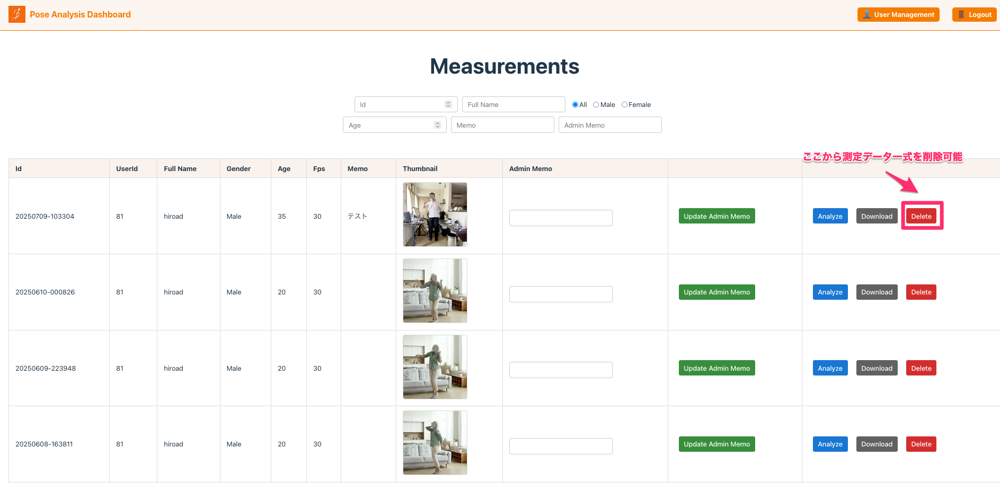

# アップデート

## iOS

### カメラ「正方形（Square）」の画角の修正

測定画面で正方形のカメラを選択した際に、ややズームが効いてしまい画角が狭くなっていたので修正した。 
これによって、以前よりは被写体との距離をやや近づけても撮影が可能になった。

### アカウント作成、メンバー追加、パスワード更新の修正

これらの処理が動作しなくなっていたので、正常動作するように修正した。 
具体的には、メール認証が絡む処理が正常に動作していなった為、それを修正した。

## Web(Pose Analysis Dashboard)

### 測定一覧画面で、任意のデータを削除できるボタンを追加

Delete ボタンを押下すると、測定したデータを削除可能に 

