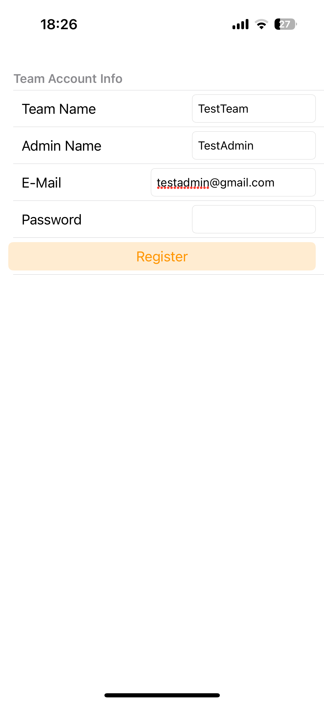
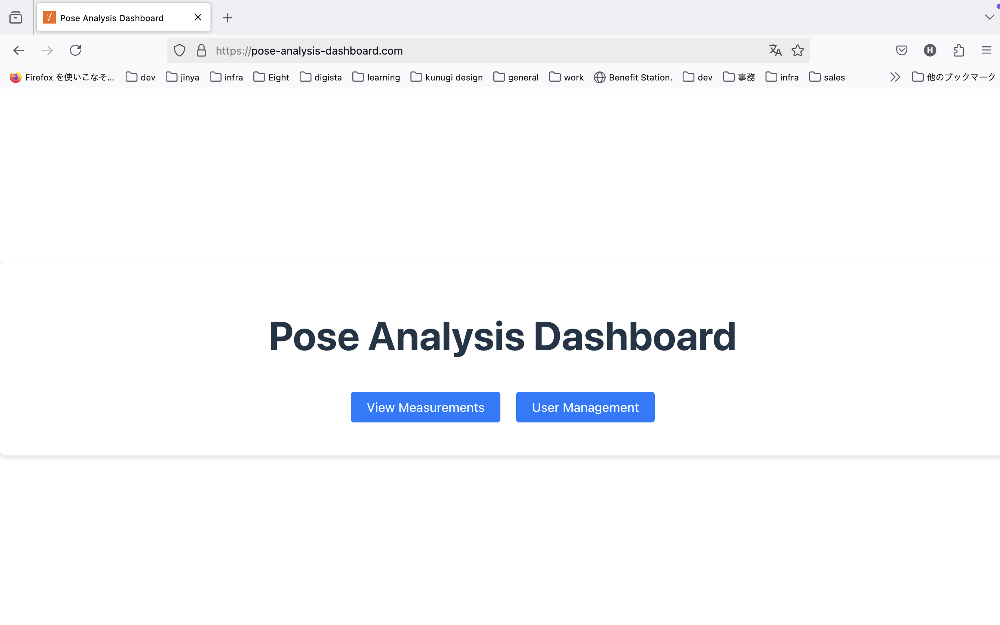
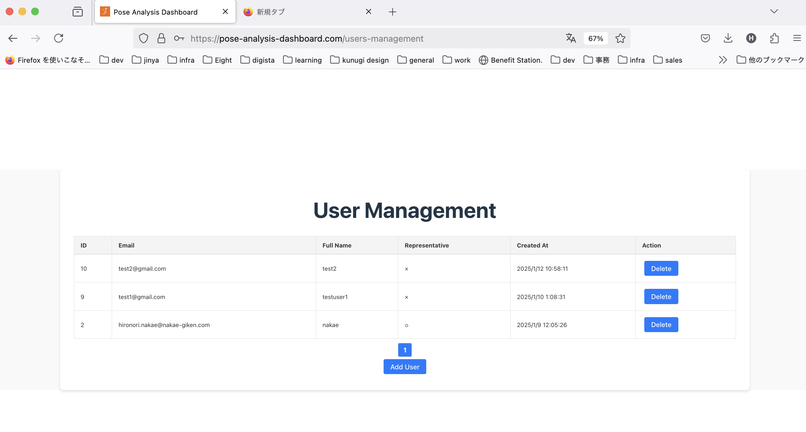
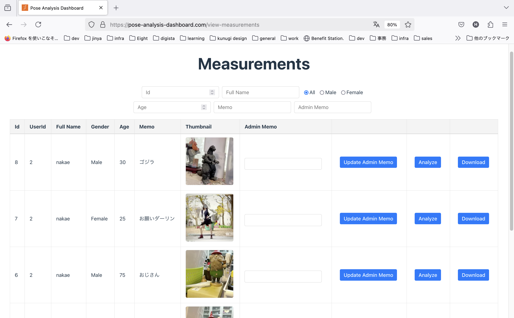

# Pose Analysis 0.19

## Overview

Sign up as a team manager using a dedicated iOS app and purchase measurement tickets via in-app purchases.  
The team manager and their members can log in using the iOS app to perform pose estimation, input basic data linked to the measurements, and upload the data to the cloud.  
The team manager can manage team members and their measurement data via a web dashboard.  

## How to Use

### User Management

The structure consists of one team manager and multiple team members associated with the team.

#### Team Manager Registration

On the iOS app’s home screen, tap the "Sign Up" button to navigate to the registration screen.  
 

On the registration screen, input the required information and tap the "Register" button to create a manager account.  
 

#### Logging into the Web Dashboard and Adding Members

The team manager can log in to the web dashboard:  
Pose Analysis Dashboard  
<a href="https://pose-analysis-dashboard.com">https://pose-analysis-dashboard.com</a>  

 

After logging in, click the "User Management" button on the top page to navigate to the user management screen.  
 
 

Click the "Add User" button to display a form at the bottom of the screen for entering information about the new user.  
After entering the information, click the "Submit" button to add the user to the team.  
 
 

#### Member Login to the iOS App

Using either a manager or member account, input the account information to log in to the iOS app.  
 

### Measurement

The iOS app allows users to upload estimation results and videos to the cloud.  
Saving and uploading measured data in the app or to the cloud requires purchasing tickets, which are available via in-app purchases.  
Tickets are sold in packages (e.g., 500 uses per package), and one use is deducted each time data is saved or uploaded by a team member.  

The team manager can view, annotate, and download uploaded data via the web dashboard.  

#### iOS App

##### Display of Remaining Measurement Count

After a successful login, the remaining measurement count for the team is displayed.  
 

An alert is shown after each measurement, asking whether to save the data.  
If the measurement is unsuccessful, selecting "No" will prevent unnecessary deduction of the remaining count.  
 

##### Purchasing Measurement Tickets

After logging in, navigate to the settings screen and tap the "Purchase Ticket" button to access the ticket purchase screen.  
 
 

Select the desired ticket package on this screen to complete the purchase.  

#### Web Dashboard

Log in with a manager account, and click the "View Managements" button on the top page to display the measurement list.  
 
 

This screen displays all measurement data for team members in descending chronological order.  
Each row includes the following items:

- Id (Measurement ID)
- UserId
- Full Name (User Name)
- Gender (Male/Female)
- Age
- Memo (Input during measurement on the iOS app)
- Thumbnail (A thumbnail image created from the midpoint frame of the video)
- Admin Memo (Free text input by the manager on the web dashboard)

The search box at the top of the screen allows filtering by the following criteria:

- Id (Measurement ID)
- Full Name (User Name)
- Gender (All/Male/Female)
- Age
- Memo
- Admin Memo

##### Download

Click the "Download" button on the right of the measurement list to download a set of measurement data as a ZIP file.  
The unzipped contents include:

- video.mov  
  - The recorded video with a gray mask applied to the face (not 100% reliable due to AI limitations).
- thumbnail.jpg  
  - The thumbnail image displayed in the list (usually unnecessary).
- row.csv  
  - Time-series data of 3D coordinates for body parts.
- lowpass.csv  
  - Filtered data from row.csv using a low-pass filter.
- kalman.csv  
  - Filtered data from row.csv using a Kalman filter.
- angles.csv  
  - Calculated joint angles based on row.csv.
- lowpass_angles.csv  
- kalman_angles.csv  

##### Analysis

Click the "Analyze" button on the right of the measurement list to navigate to the analysis screen for the selected measurement.  
 

The analysis screen includes features similar to the iOS app’s Analyze screen, with the following items:

- Basic Information  
  - Gender  
  - Age  
  - Memo  
  - Admin Memo  

- Video Player  
  - Displays the video with the same gray mask applied to the face.  

- Stick Figure of Inference Results  
  - Synced with the video playback position.  

- Coordinates of Body Parts  
  - Selectable via a dropdown menu.  
  - A red line indicates the current frame in the video.  

- Joint Angles  
  - Selectable via a dropdown menu.  
  - A red line indicates the current frame in the video.  

### End