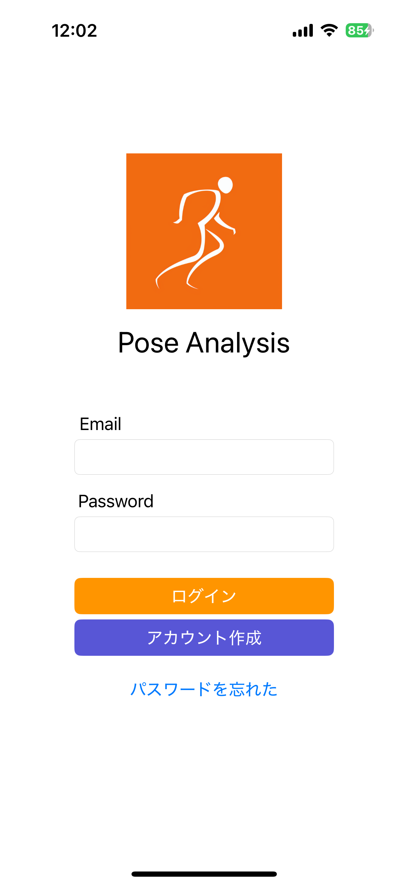
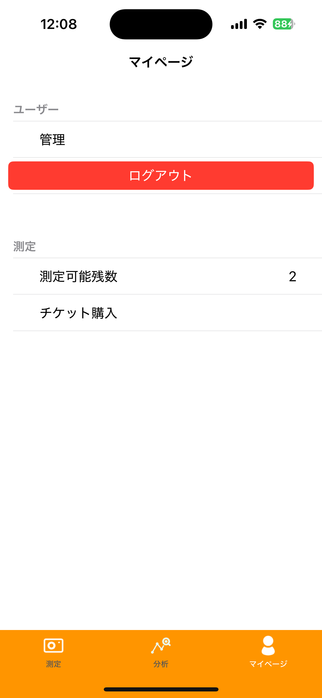
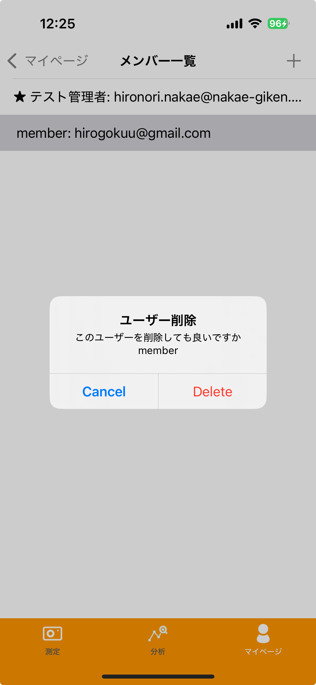
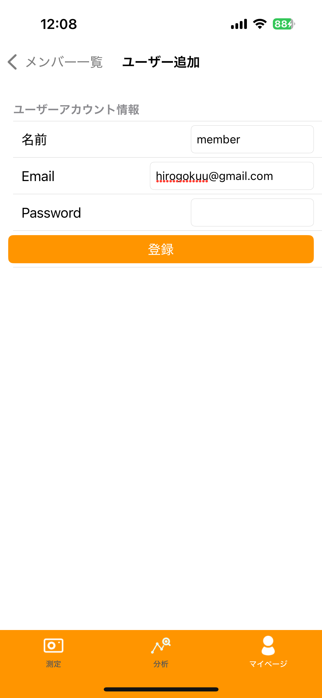
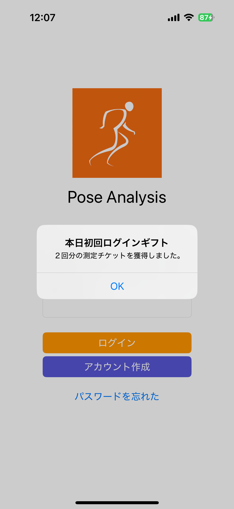
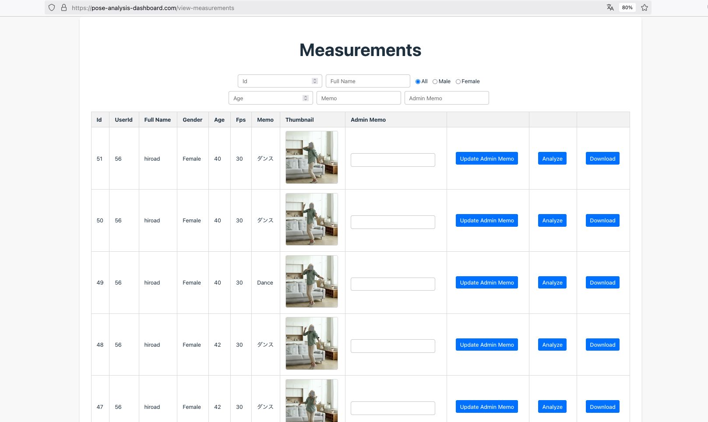

# Pose Analysis 0.29

## 概要

専用の iOS アプリでチーム管理者としてサインアップしログインする。 
チーム管理者は、iOS アプリ、或いは、 Web のダッシュボードでチームメンバーの追加や削除が可能である。 
チーム管理者、及び、そのメンバーは専用の iOS アプリでログインし、姿勢推定を行い、そのデータに紐づく基本データを入力してクラウドにアップロードする。 
この保存にはローカル環境への保存のクラウドへのアップロードが含まれるが、これらを行うには残測定可能数を消費する。 
この数は、毎日ログインするごとに貰えるログインギフトか、iOS アプリ内のマイページから保存チケットを購入することによって獲得できる。 
また、保存されたデータは、専用の Web ダッシュボードからも確認できる。 
このダッシュボードにログインできるのは、チーム管理者アカウントのみ。 
管理者はこのダッシュボードでチームのメンバーがアップロードしたデータを一括管理できる。

## 使い方

### ユーザー管理

チーム管理者一名、そのチームに紐ずくメンバー複数名という構成。

#### チーム管理者登録

iOS アプリのトップ画面で、ボタン「サインアップ」を押下すると、管理者登録画面に遷移する。 
 

管理者登録画面で、所定の情報を入力して、ボタン「登録」を押下すると、管理者アカウントが仮登録される。 
 

入力したメールアドレス宛にメールが来るので、そこにあるリンクにWebブラウザからアクセスすることでユーザーを有効化できる。 

#### メンバー管理

iOS アプリ内でもユーザー管理ができる。 
ログイン後、画面下部の右側にある「マイページ」というタブを選択すると、上部に「管理」という項目があるので、そこを選択すると、ユーザー一覧画面に遷移する。 
 
 

当該画面には、チーム内の全メンバーの一覧が表示される。 
一覧表の各項目には、「⭐️:  {Full Name}:  {メールアドレス」というフォーマットで表示される。 
チームの管理者である場合は、冒頭に⭐️がつくという仕様である。 

一覧の中から任意のメンバーをタップすると、アラートが表示され、その中で「Delete」を選択すると、当該メンバーが削除される。 
 

また、当該画面の右上にある「＋」ボタンを押下すると、新規メンバー追加画面に遷移する。 
 

当該画面で、新規メンバーの情報を入力して、ボタン「登録」を押下すると、新規メンバーのメールアドレス宛にメールが飛ぶ。 
後はサインアップの時と同様に、メール本文内のURLリンクにアクセスしてユーザーを有効化すれば登録が完了となる。

#### Web ダッシュボードへのログインとメンバー追加

チーム管理者は Web ダッシュボードにログインができる。 
Pose Analysis Dashboard 
<a href="https://pose-analysis-dashboard.com">https://pose-analysis-dashboard.com</a> 

 

ログイン後、トップページビューから、ボタン「User Management」を押下すると、ユーザ管理画面に遷移する。 

 
 

ボタン「Add User」を押下すると、画面下部に新規追加するユーザー情報を入力するフォームが表示されるので、 
そこに入力してボタン「Submit」を押下すると、対象のチームにユーザーを追加できる。 
 
 

#### iOS アプリへのメンバーログイン

管理者アカウント、或いは、メンバーアカウント情報を入力して、iOS アプリにログインができる。 
 

### 測定

iOS アプリで測定した推定結果や動画をクラウド上にアップロードすることができる。 
測定したデータをスマホアプリに保存、及び、クラウドにアップロードする機能は有料のチケットを購入することで利用ができる。 
このチケットは iOS アプリ内で購入ができる。 
チケットは例えば 500回分などで販売され、チーム内のメンバーが測定データを保存、及び、アップロードするごとに１回分消費される。 
 
また、チーム管理者はチームのメンバーがアップロードしたデータを Web ダッシューボードから閲覧、メモ書き、及び、ダウンロードすることができる。 

#### iOS アプリ

##### 測定可能な残回数の表示

「マイページ」タブを選択すると、測定 > 測定可能残回数という項目がある。 
 

測定する度に、以下のようなアラートが表示されて、保存するかを聞かれるので、そこで保存とアップロードを行うか否かを制御している。 
上手く測定ができなかった時は、ここで No を押下すれば、残測定回数が不要に減少することはない。 
 

##### 測定チケットのギフトと購入

毎日、その日の最初のログイン時にギフトとして保存チケットが貰える。 
これによって測定データを２回分保存できる。 

「マイページ」タブを選択すると、測定 > チケット購入 という項目があり、そこに購入可能なチケットの一覧が表示される。 
 
 

当該画面で、購入したいチケットを選択することで購入できる。 

#### Web ダッシュボード

管理者アカウントでログインし、Top ページから、ボタン「View Managements」を押下すると測定一覧が表示される。 
 
 
当該画面では、チーム内の全メンバーの測定データの一覧が時系列の降順で表示される。 
一覧表には、各測定データごとに以下の項目が表示されている。

- Id（測定ID）
- UserId
- Full Name（ユーザー名）
- Gender(Male/Female)
- Age
- Memo（iOSアプリで測定時に入力）
- Thumbnail （サムネイル画像。動画の丁度中間時点のフレームをサムネイル化。）
- Admin Memo（Webダッシュボードで管理者が自由に入力できる）

また、上部のテキストボックスに条件を入力することで条件検索ができる。 
検索項目は以下の通り。

- id （測定ID）
- Full Name （ユーザー名）
- 性別（All/Male/Female）
- Age（年齢）
- Memo
- Admin memo

##### ダウンロード

測定一覧表の右端のボタン「Download」を押下すると、測定データの一式が zip 形式でダウンロードされる。 
解凍すると以下のデータがある。

- video.mov
  - 録画映像。顔には灰色のマスクがかけられているが、 AIによるものなので１００％ではない。
- thumbnail.jpg
  - 一覧表に表示されているサムネイル画像。基本的には不要。
  - row.csv
    - 各部位の３次元座標の時系列データ
  - loapass.csv
    - row.csv にローパスフィルタをかけたデータ
  - kalman.csv
    - row.csv にカルマンフィルタをかけたデータ
  - angles.csv
    - row.csv を元に各関節の角度を算出したデータ
  - lowpass_angles.csv
  - kalman_angles.csv

##### 分析

測定一覧表の右の方にあるボタン「Analyze」を押下すると、対象の測定の分析画面に遷移する。 
 
分析画面では、iOS アプリの Analyze 画面と同様の機能が実装されている。 
以下の項目がある。 
- 基本情報
  - gender
  - age
  - memo
  - admin memo

- 動画プレイヤー
  - ダウンロード動画と同様に、顔には灰色のマスクがかかっている。
- 推論結果の棒人間（動画の再生位置に同期している）
- 体の各部位の座標
  - 表示項目は上部のセレクトボックスで選択
  - 動画の再生に応じて、表示フレームの位置に赤いラインが入る
- 各関節の角度
  - 表示項目は上部のセレクトボックスで選択
  - 動画の再生に応じて、表示フレームの位置に赤いラインが入る
  
### 以上
