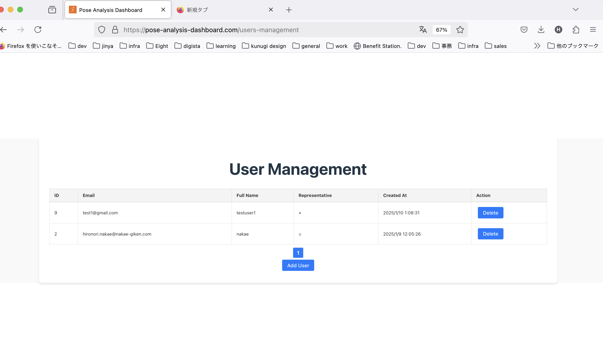
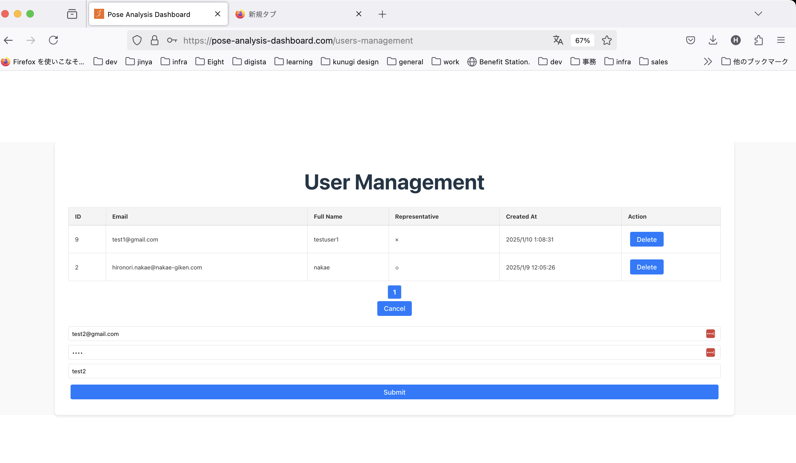

# Pose Analysis

## 概要

iOS アプリで姿勢推定を行い、その測定データを解析できる。 
また、クラウドにアップロードすることで、専用の Web ダッシュボードから、チーム内のメンバーの測定データを閲覧、分析、ダウンロードができる。 

サインアップは iOS アプリから行う。 
メンバーの追加は、iOS アプリでもWeb ダッシュボードでも行える。 

## コンテンツ

### iOS アプリ

iPhone / iPad 向けのアプリケーション. 
ユーザー管理、測定、エクスポート、分析、アップロードが可能。 
<a href="https://apps.apple.com/jp/app/pose-analysis/id6737680737">Download on App Store</a>

あくまで当該アプリは測定、分析ツールという位置付けであり、サインアップするアカウントを変更しても、ローカルファイル内にある測定データは引き継がれない。 
 

### Web ダッシュボード
Web ブラウザ向けのダッシュボード. 
ユーザー管理、測定データの閲覧、分析、ダウンロードが可能。 
<a href="https://pose-analysis-dashboard.com/">Pose Analysis Web Dashboard</a>

## 使い方

### まずは測定してみたい場合

iOS アプリをインストールして、ゲストモードでログインする。 
ゲストモードでは、ユーザー登録を行わずに、アプリの測定、及び、分析機能を試すことができる。 
 

測定データをアップロードしたくなった段階で、サインアップすれば、そのデータをアップロード可能。 

### ユーザー管理

チーム管理者一名、そのチームに紐ずくメンバー複数名という構成。

#### チーム管理者登録

iOS アプリのトップ画面で、ボタン「アカウント作成」を押下すると、管理者登録画面に遷移する。 
 

管理者登録画面で、所定の情報を入力して、ボタン「登録」を押下すると、管理者アカウントが仮登録される。 
 

入力したメールアドレス宛にメールが来るので、そこにあるリンクにWebブラウザからアクセスすることでユーザーを有効化できる。 

#### メンバー管理

iOS アプリ内でもユーザー管理ができる。 
ログイン後、画面下部の右側にある「マイページ」というタブを選択すると、上部に「管理」という項目があるので、そこを選択すると、ユーザー一覧画面に遷移する。 
 
 

当該画面には、チーム内の全メンバーの一覧が表示される。 
一覧表の各項目には、「⭐️:  {Full Name}:  {メールアドレス」というフォーマットで表示される。 
チームの管理者である場合は、冒頭に⭐️がつくという仕様である。 

一覧の中から任意のメンバーをタップすると、アラートが表示され、その中で「Delete」を選択すると、当該メンバーが削除される。 
 

また、当該画面の右上にある「＋」ボタンを押下すると、新規メンバー追加画面に遷移する。 
 

当該画面で、新規メンバーの情報を入力して、ボタン「登録」を押下すると、新規メンバーのメールアドレス宛にメールが飛ぶ。 
後はサインアップの時と同様に、メール本文内のURLリンクにアクセスしてユーザーを有効化すれば登録が完了となる。

#### Web ダッシュボードへのログインとメンバー追加

チーム管理者は Web ダッシュボードにログインができる。 
Pose Analysis Dashboard 
<a href="https://pose-analysis-dashboard.com">https://pose-analysis-dashboard.com</a> 

 

ログイン後、トップページビューから、ボタン「User Management」を押下すると、ユーザ管理画面に遷移する。 

 
 

ボタン「Add User」を押下すると、画面下部に新規追加するユーザー情報を入力するフォームが表示されるので、 
そこに入力してボタン「Submit」を押下すると、対象のチームにユーザーを追加できる。 
 
 

#### iOS アプリへのメンバーログイン

管理者アカウント、或いは、メンバーアカウント情報を入力して、iOS アプリにログインができる。 
 

### 測定

iOS アプリで測定した推定結果や動画をクラウド上にアップロードすることができる。 
測定したデータをスマホアプリに保存、及び、クラウドにアップロードする機能は有料のチケットを購入することで利用ができる。 
このチケットは iOS アプリ内で購入ができる。 
チケットは例えば 10回分などで販売され、チーム内のメンバーが測定データを保存、及び、アップロードするごとに１回分消費される。 
 
また、チーム管理者はチームのメンバーがアップロードしたデータを Web ダッシューボードから閲覧、メモ書き、及び、ダウンロードすることができる。 

#### 基本手順

アプリにログイン（またはゲストモードでログイン）すると、測定画面が開く。 
 

中央下部の丸いボタンを押下すると、測定が開始される。 
測定が開始されると、丸いボタンが四角い停止ボタンに変わる。 
測定を停止したい場合は、四角い停止ボタンを押下する。 
測定が停止されてから数秒間は、各種CSVデータファイルが生成されるため、数秒待機する。 
完了するとアラート画面でローカルに保存されたことが確認できる。 

#### 入力

測定画面の左下部分のテキストボックスを押下すると、入力を選択できる。 
 

姿勢推定は以下から選択して行える。
- リアカメラ正方形
- リアカメラ縦長
- フロントカメラ正方形
- フロントカメラ縦長
- 動画

 

#### CSV の仕様

測定されたデータは、ローカルフォルダに保存されており、ファイルアプリなどで取り出しも可能。 
ローカルフォルダ内には日時ごとにフォルダが作成され、その中に以下の測定データが保存される。 

- `raw.csv`
  - 姿勢推定の生データを含むメインの CSV ファイル
  - ワンユーロフィルタが適用された座標も含まれています
    - ワンユーロフィルタはローパスフィルタの一種で、ノイズを除去し、より滑らかな動きを実現するために使用されます
- `angles.csv`
  - `raw.csv` の 生データである `X`, `Y`, `Z` の値を角度に変換したもの
- `one_euro_angles.csv`
  - `raw.csv` の ワンユーロフィルタ適用後の `OneEuroX`, `OneEuroY`, `OneEuroZ` の値を角度に変換したもの

更に詳しい仕様について、[こちら](./0.38/README.md)を参照のこと。 

#### 測定可能な残回数の表示

「マイページ」タブを選択すると、測定 > 測定可能残回数という項目がある。 
 

測定する度に、以下のようなアラートが表示されて、保存するかを聞かれるので、そこで保存とアップロードを行うか否かを制御している。 
上手く測定ができなかった時は、ここで No を押下すれば、残測定回数が不要に減少することはない。 
 

#### 測定チケットのギフトと購入

毎日、その日の最初のログイン時にギフトとして保存チケットが貰える。 
これによって測定データを２回分保存できる。 

「マイページ」タブを選択すると、測定 > チケット購入 という項目があり、そこに購入可能なチケットの一覧が表示される。 
 
 

当該画面で、購入したいチケットを選択することで購入できる。 

 
2025年6月13日現在のチケットの価格は以下の通り。 

- 10回測定チケット
  - 更新後価格：100円
    - 修正前：1,000円
- 100回測定チケット
  - 更新後価格：1000円
    - 修正前：10,000円
- 1000回測定チケット
  - 更新後価格：10,000円
    - 修正前：100,000円

尚、チケットの価格は今後変更される可能性がある。 

### Web ダッシュボード

管理者アカウントでログインし、Top ページから、ボタン「View Managements」を押下すると測定一覧が表示される。 
 
 
当該画面では、チーム内の全メンバーの測定データの一覧が時系列の降順で表示される。 
一覧表には、各測定データごとに以下の項目が表示されている。

- Id（測定ID）
- UserId
- Full Name（ユーザー名）
- Gender(Male/Female)
- Age
- Memo（iOSアプリで測定時に入力）
- Thumbnail （サムネイル画像。動画の丁度中間時点のフレームをサムネイル化。）
- Admin Memo（Webダッシュボードで管理者が自由に入力できる）

また、上部のテキストボックスに条件を入力することで条件検索ができる。 
検索項目は以下の通り。

- id （測定ID）
- Full Name （ユーザー名）
- 性別（All/Male/Female）
- Age（年齢）
- Memo
- Admin memo

##### ダウンロード

測定一覧表の右端のボタン「Download」を押下すると、測定データの一式が zip 形式でダウンロードされる。 
解凍すると以下のデータがある。

- `raw.csv`
  - 姿勢推定の生データを含むメインの CSV ファイル
  - ワンユーロフィルタが適用された座標も含まれています
    - ワンユーロフィルタはローパスフィルタの一種で、ノイズを除去し、より滑らかな動きを実現するために使用されます
- `angles.csv`
  - `raw.csv` の 生データである `X`, `Y`, `Z` の値を角度に変換したもの
- `one_euro_angles.csv`
  - `raw.csv` の ワンユーロフィルタ適用後の `OneEuroX`, `OneEuroY`, `OneEuroZ` の値を角度に変換したもの
- video.mov
  - 録画映像。顔には灰色のマスクがかけられているが、 AIによるものなので１００％ではない。
- thumbnail.jpg
  - 一覧表に表示されているサムネイル画像。基本的には不要。

##### 分析

測定一覧表の右の方にあるボタン「Analyze」を押下すると、対象の測定の分析画面に遷移する。 
 
分析画面では、iOS アプリの Analyze 画面と同様の機能が実装されている。 
以下の項目がある。 
- 基本情報
  - gender
  - age
  - memo
  - admin memo

- 動画プレイヤー
  - ダウンロード動画と同様に、顔には灰色のマスクがかかっている。
- 推論結果の棒人間（動画の再生位置に同期している）
- 体の各部位の座標
  - 表示項目は上部のセレクトボックスで選択
  - 動画の再生に応じて、表示フレームの位置に赤いラインが入る
- 各関節の角度
  - 表示項目は上部のセレクトボックスで選択
  - 動画の再生に応じて、表示フレームの位置に赤いラインが入る
  
### 以上
